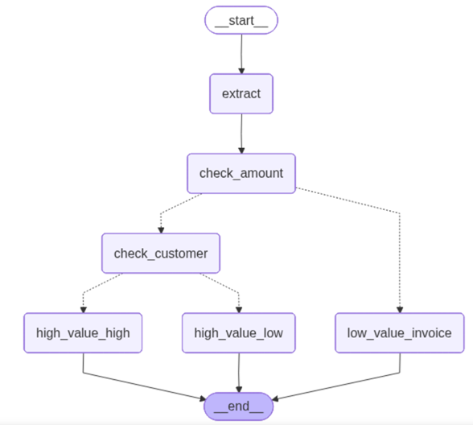
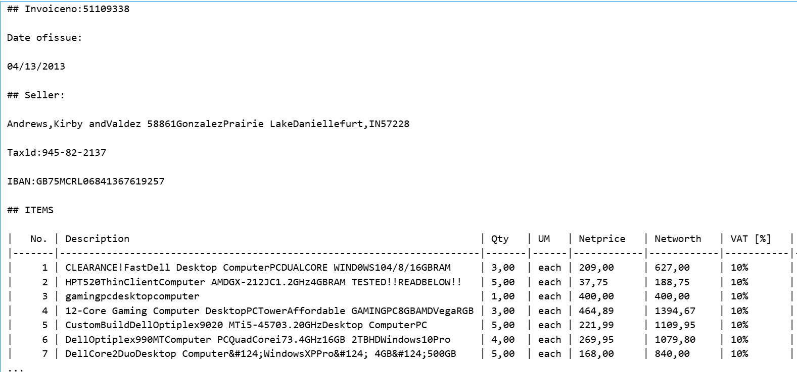
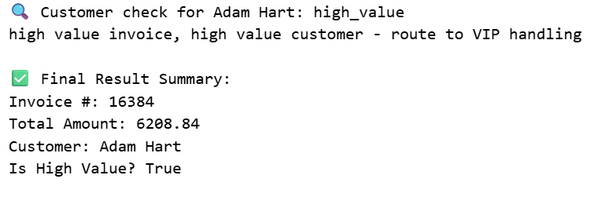

# 🚀 End-to-End Autonomous Invoice Agent

### Multi-Modal Document AI with LangGraph, Docling, Groq & Gemini

---

## 🎯 Problem Statement
Processing invoices manually is slow, error-prone, and difficult to scale. This project demonstrates how to build an **autonomous AI agent** capable of:
* Extracting structured data from complex PDF invoices
* Understanding both **text and layout (vision)**
* Making **business decisions automatically**
* Interacting with external tools like databases

---

## 🏗️ System Architecture
The system operates as a **stateful Directed Acyclic Graph (DAG)** orchestrated by LangGraph.



### The Flow:
1. **Input:** PDF Invoice
2. **Extract Node:** Multi-modal data extraction (Groq + Gemini)
3. **Decision Node:** Conditional logic (amount threshold)
4. **Agent Node:** Database query (customer tier)
5. **Output:** Automated / Manual / VIP Processing

---

## 📖 Project Journey (From 1 to 5)

### 1️⃣ Document Representation
Convert complex PDFs into structured Markdown and high-quality images using **IBM Docling**.


### 2️⃣ Hybrid Extraction
Use a dual-engine strategy: **Groq (Llama 3.1)** for fast text and **Gemini 1.5 Flash** for visual understanding.

### 3️⃣ Structured Outputs
Enforce strict schemas using **Pydantic** to transform LLM outputs into validated Python objects.


### 4️⃣ Conditional Logic & 5️⃣ Agentic Tool Use
Build a stateful workflow that queries a **SQLite database** to detect VIP clients and apply business rules.

---

## 📸 Final Decision Output
Here is a trace of the agent's final decision after checking the database and invoice value:


---

## 🛠️ Tech Stack
* **Orchestration:** LangGraph
* **Document Parsing:** Docling (IBM)
* **LLMs:** Groq (Llama 3.1 8B / 70B)
* **Vision Models:** Google Gemini 1.5 Flash
* **Validation:** Pydantic
* **Database:** SQLite

---

## 🚀 Installation & Setup

### 1. Clone the repository
```bash
git clone [https://github.com/HajarBoutayeb/autonomous-invoice-agent.git](https://github.com/HajarBoutayeb/autonomous-invoice-agent.git)
cd autonomous-invoice-agent

### 2. Install dependencies

```bash
pip install -U docling langgraph langchain-groq langchain-google-genai pydantic
```

### 3. API Configuration

```python
import os

os.environ["GROQ_API_KEY"] = "your_key"
os.environ["GOOGLE_API_KEY"] = "your_key"
```

## 📊 Key Results

* ⚡ **Cost-Efficient Inference** using Groq & Gemini free tiers
* 🎯 **High Accuracy** via hybrid text + vision extraction
* 🔍 **Full Observability** with LangGraph workflow tracing
* 🤖 **Autonomous Decision-Making** via conditional routing

---

## ⚙️ Future Improvements

* Add retry & fallback mechanisms (Groq ↔ Gemini)
* Support multi-page invoices
* Build a human-in-the-loop validation UI
* Deploy as an API (FastAPI)
* Add monitoring & logging system

---

## 🧠 Key Concepts

* Multi-Modal AI
* Agentic Workflows
* Retrieval & Tool Usage
* Structured LLM Outputs
* Decision Automation

---

## 📝 Author

**Hajar Boutayeb**
Master’s Student in Data Science & Big Data

---

## ⭐ If you like this project

Give it a ⭐ on GitHub and feel free to contribute!
